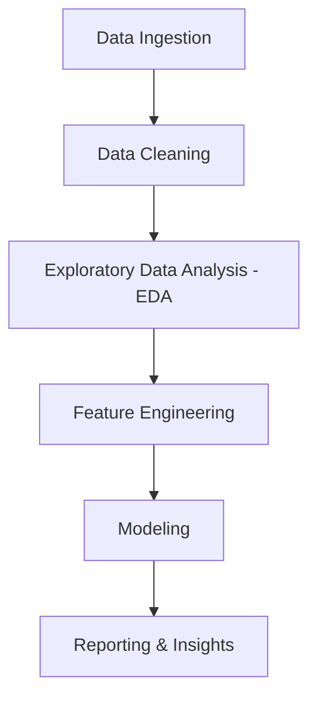

# Smart Product Analysis

## Overview
Smart Product Analysis is a tool designed for analyzing product data to extract meaningful insights. It leverages data science libraries to process, visualize, and model product-related datasets.

## Setup
To set up the project, follow these steps:
1. Clone the repository.
2. Install the required dependencies:
   ```bash
   pip install -r requirements.txt
   ```
3. Run the analysis script:
   ```bash
   python src/main.py
   ```

## Workflow



### Workflow Description
1. **Data Ingestion**: Importing raw product data from various sources.
2. **Data Cleaning**: Handling missing values, outliers, and data inconsistencies.
3. **Exploratory Data Analysis (EDA)**: Visualizing data distributions and identifying patterns.
4. **Feature Engineering**: Creating new features to improve model performance.
5. **Modeling**: Applying machine learning algorithms to make predictions or classifications.
6. **Reporting & Insights**: Summarizing findings and providing actionable business insights.
