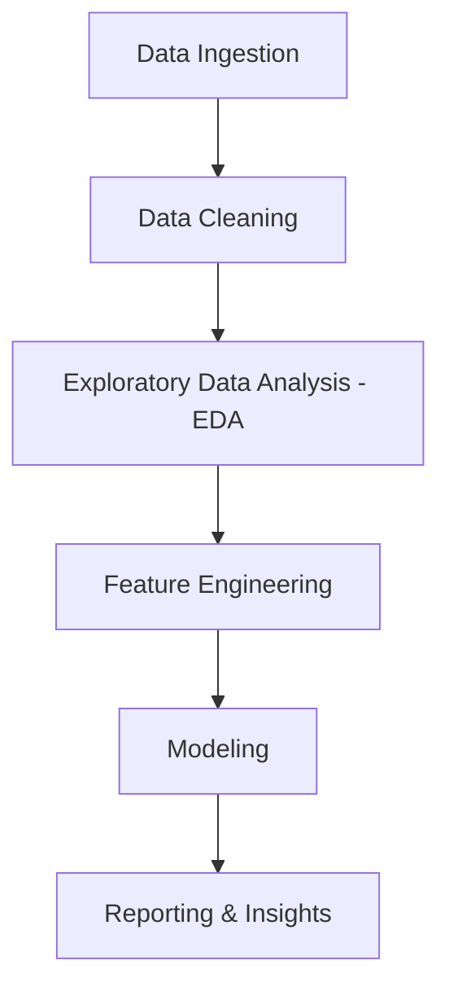

# Smart Product Analysis

## Overview
Smart Product Analysis is a tool designed for analyzing product data to extract meaningful insights. It leverages data science libraries to process, visualize, and model product-related datasets.

## Setup
To set up the project, follow these steps:
1. Clone the repository.
2. Install the required dependencies:
   ```bash
   pip install -r requirements.txt
   ```
3. Run the analysis script:
   ```bash
   python src/main.py
   ```

## Workflow



### Workflow Description
The data analysis pipeline follows a structured process:
1.  **Data Ingestion**: Importing raw product data.
2.  **Data Cleaning**: Preprocessing and handling missing values.
3.  **Exploratory Data Analysis (EDA)**: Visualizing and understanding data distributions and relationships.
4.  **Feature Engineering**: Creating and selecting relevant features for analysis.
5.  **Modeling**: Applying statistical or machine learning models to the data.
6.  **Reporting & Insights**: Extracting and communicating findings.
